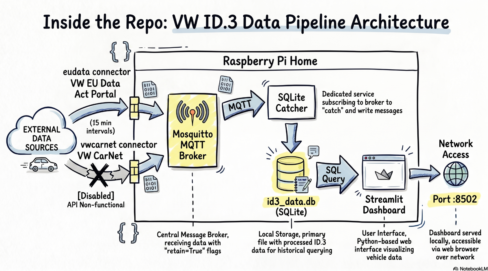

# ⚡ myCar.dashboard

> Self-hosted VW ID.3 monitoring stack running on a Raspberry Pi — real-time SOC, charging sessions, trip history, battery health, and ABRP integration.


---

## Architecture



---

## Services

| Service | Container | Description |
|---|---|---|
| `mosquitto` | `id3_mosquitto` | MQTT broker — message bus for all vehicle data |
| `eudata` | `id3_eudata` | VW EU Data Act connector — polls vehicle state every 15 min |
| `vwcarnet` | `id3_vwcarnet` | volkswagencarnet connector — **disabled** (VW broke unofficial API May 2026) |
| `sqlite_catcher` | `id3_sqlite_catcher` | Subscribes to all MQTT topics and persists to SQLite |
| `dashboard` | `id3_dashboard` | Streamlit web dashboard on port 8502 |

---

## Dashboard (German)

Three pages, dark-themed, auto-refresh every 5 minutes:

- **Übersicht** — Live SOC gauge, range, odometer, charging status, API health indicator, monthly statistics (km driven, energy charged, cost estimate, battery SoH trend)
- **Ladevorgänge** — Active charging state, session timeline chart, historical session log with energy/cost/duration
- **Trips** — Trip history detected from vehicle state transitions, map visualization of historical GPS tracks

---

## Data Source: VW EU Data Act Portal

Since VW killed the WeConnect API on **27 May 2026**, this stack uses the free [VW EU Data Act portal](https://eu-data-act.drivesomethinggreater.com) — mandated by EU regulation, no subscription required.

**What's available:**

| Field | Available |
|---|---|
| State of Charge (SOC) | ✅ |
| Estimated range | ✅ |
| Odometer | ✅ |
| Charging state & power | ✅ |
| Target SOC / max current | ✅ |
| GPS position | ❌ |
| Doors / windows | ❌ |
| Climate details | ❌ |
| **Polling frequency** | **15 min** |

> The `vwcarnet/` service provides a ready-to-enable connector based on [volkswagencarnet](https://github.com/robinostlund/volkswagencarnet) (5 min polling, GPS, full telemetry) — re-enable it if/when the upstream library regains working auth against VW's backend.

---

## ABRP Integration

The eudata connector pushes live SOC and charging state to [A Better Route Planner](https://abetterrouteplanner.com) after every successful poll. Set your ABRP user token in `.env` to enable.

---

## Setup

### 1. Configure the VW EU Data Act Portal

The data source is VW's free EU Data Act portal — mandated by law, no subscription needed. You need to activate continuous data delivery once before this stack can receive anything.

> **Requirements:** Your VW ID account must hold the **Primary User** role for the vehicle (i.e. the account the car is registered to).

1. Go to [eu-data-act.drivesomethinggreater.com](https://eu-data-act.drivesomethinggreater.com) and log in with your VW ID credentials (same as the VW app)
2. Your vehicle should appear automatically — if not, check that you are the Primary User in the VW app under *Account → Manage users*
3. Click **"Get customised data"** (or similar, UI may vary) and select your vehicle
4. Choose **"All data clusters"** to enable everything this stack can use
5. Set frequency to **continuous** and duration to your preference (e.g. 1 year)
6. Confirm the request — data delivery starts within a few minutes

The `eudata` connector polls the portal every 15 minutes and downloads the latest ZIP dataset automatically. No further manual steps needed.

> **Note:** The portal occasionally returns HTTP 500 errors server-side (VW infrastructure issue). The connector retries automatically on the next poll cycle — no action needed.

---

### 2. Prerequisites

- Raspberry Pi (tested on Pi 5, aarch64) with Docker + Docker Compose
- VW ID account configured as above

### 3. Clone & configure

```bash
git clone https://github.com/yourusername/myCar.git
cd myCar
cp .env.example .env
```

Edit `.env`:

```env
VW_USERNAME=your@email.com
VW_PASSWORD=yourpassword
MQTT_USER=mqttuser
MQTT_PASSWORD=mqttpassword
VIN=WVWZZZE000000000
ABRP_TOKEN=your-abrp-token          # optional
```

### 4. Start the stack

```bash
docker compose up -d
```

Dashboard is available at `http://<pi-ip>:8502`

---

## Environment Variables

| Variable | Service | Description |
|---|---|---|
| `VW_USERNAME` | eudata, vwcarnet | VW account email |
| `VW_PASSWORD` | eudata, vwcarnet | VW account password |
| `MQTT_USER` | all | MQTT broker username |
| `MQTT_PASSWORD` | all | MQTT broker password |
| `ABRP_TOKEN` | eudata | ABRP user token (optional) |
| `POLL_INTERVAL_SECONDS` | eudata | Poll interval in seconds (default: 900) |
| `VIN` | dashboard | Your vehicle VIN (required) |

---

## MQTT Topic Structure

All topics use the pattern `<source>/vehicles/<VIN>/<suffix>` — the SQLite catcher stores every message and the dashboard queries with `LIKE '%<suffix>'`, so both `eudata/` and `vwcarnet/` sources work transparently.

```
eudata/vehicles/<VIN>/drives/primary/level       # SOC %
eudata/vehicles/<VIN>/drives/primary/range       # Range km
eudata/vehicles/<VIN>/odometer                   # Odometer km
eudata/vehicles/<VIN>/charging/state             # charging | off | invalid
eudata/vehicles/<VIN>/charging/power             # kW
eudata/vehicles/<VIN>/charging/settings/target_level    # Target SOC %
eudata/vehicles/<VIN>/charging/settings/maximum_current # A
eudata/vehicles/<VIN>/charging/type              # ac | dc
eudata/vehicles/<VIN>/garage/<VIN>/state         # parked | charging | driving
eudata/last_update                               # ISO timestamp of last poll attempt
eudata/api_status                               # ok | HTTP 500 | Auth-Fehler | …
```

---

## Project Structure

```
myCar/
├── docker-compose.yml
├── .env                        # credentials (not committed)
│
├── eudata/                     # VW EU Data Act connector (primary)
│   ├── api.py                  # OIDC auth + portal API client
│   ├── connector.py            # polling loop → MQTT + ABRP push
│   ├── Dockerfile
│   └── requirements.txt
│
├── vwcarnet/                   # volkswagencarnet connector (fallback, disabled)
│   ├── connector.py
│   ├── Dockerfile
│   └── requirements.txt
│
├── catcher/                    # MQTT → SQLite persistence
│   ├── catcher.py
│   └── Dockerfile
│
├── dashboard/                  # Streamlit dashboard
│   ├── app.py                  # navigation shell
│   └── pages/
│       ├── uebersicht.py       # overview
│       ├── laden.py            # charging sessions
│       └── trips.py            # trip history
│
└── mosquitto/                  # MQTT broker config
    └── mosquitto.conf
```

---

## Historical Data

All MQTT messages are stored in `database/id3_data.db` (SQLite). Historical data from the old WeConnect API (pre May 2026) is preserved — monthly statistics, trip charts, and SoH trend go back to when the stack was first deployed.

---

## Battery Health (SoH) (experimental!)

The dashboard estimates State of Health from real charging session data: energy delivered (calculated from charging power × time) divided by the SOC delta, compared against the 58 kWh nominal capacity. Requires sessions with ≥ 20% SOC delta. Displayed as a monthly trend.

---

## Adapting for Other Vehicles

This stack was built for a **VW ID.3 (58 kWh, 2021)**. Several values are hardcoded and need updating if you use a different vehicle or live somewhere with different electricity prices.

### VIN

Set your VIN in `.env` — the dashboard reads it from the environment at startup:

```env
VIN=WVWZZZE000000000
```

The `VIN` environment variable is passed to the dashboard container via `docker-compose.yml`. No source file edits needed.

### Battery capacity

Used to calculate energy (kWh) from SOC deltas and for the SoH estimate:

| File | Line | Value |
|---|---|---|
| `dashboard/pages/uebersicht.py` | 12 | `BATTERY_KWH = 58` |
| `dashboard/pages/laden.py` | 12 | `BATTERY_KWH = 58` |
| `dashboard/pages/trips.py` | 11 | `BATTERY_KWH = 58` |

For reference: ID.3 Pure = 45 kWh, ID.3 Pro = 58 kWh, ID.3 Pro S = 77 kWh.

### Electricity cost estimates

Used only for the cost display in the Ladevorgänge and Übersicht pages — adjust to your local tariff:

| File | Lines | Values |
|---|---|---|
| `dashboard/pages/uebersicht.py` | 13–14 | `COST_AC = 0.25` · `COST_DC = 0.60` (€/kWh) |
| `dashboard/pages/laden.py` | 13–14 | `COST_AC = 0.25` · `COST_DC = 0.60` (€/kWh) |

### Max AC charging current (eudata connector)

The EU Data Act portal returns enum strings for the max current setting. The mapping in `eudata/connector.py` (line 79) uses the ID.3 values of 16 A (maximum) and 8 A (reduced). Other VW/Skoda/Audi EVs may differ — check your vehicle spec:

```python
_MAX_CURRENT_MAP = {
    "max_charge_current_ac_maximum": "16",   # adapt if your car's max differs
    "max_charge_current_ac_reduced": "8",    # adapt if your car's reduced differs
}
```

---

## Credits

This project builds on the work of several open source projects and communities:

### [carconnectivity](https://github.com/tillsteinbach/carconnectivity)
The original data stack this project was built on. [@tillsteinbach](https://github.com/tillsteinbach)'s `carconnectivity-mqtt` image handled VW WeConnect API polling and MQTT publishing from day one — the entire topic structure and SQLite schema in this project are inherited from that foundation. VW killed the underlying API on 27 May 2026, but all historical data collected via carconnectivity is preserved in the database.

### [hass-vw-eu-data-act](https://github.com/cgerke/hass-vw-eu-data-act)
The `eudata/api.py` OIDC authentication flow and EU Data Act portal client are a standalone adaptation of this Home Assistant integration by [@cgerke](https://github.com/cgerke). MIT licensed. All credit for reverse-engineering the VW EU Data Act portal API goes to the original authors.

### [volkswagencarnet](https://github.com/robinostlund/volkswagencarnet)
The `vwcarnet/` service uses this library by [@robinostlund](https://github.com/robinostlund) and contributors. It provides the WeConnect API client that enables full vehicle telemetry (GPS, doors, climate, fine-grained charging data) when VW's unofficial API is accessible. MIT licensed.

### Community
Authentication flows, field name mappings, and API behavior were pieced together from discussions in the Home Assistant community, the volkswagencarnet issue tracker, and various EV enthusiast forums. VW does not provide official developer documentation for any of these APIs.

---

## License

MIT — do whatever you want with it.
